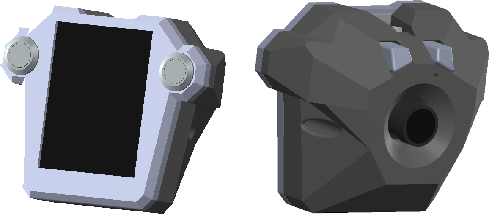
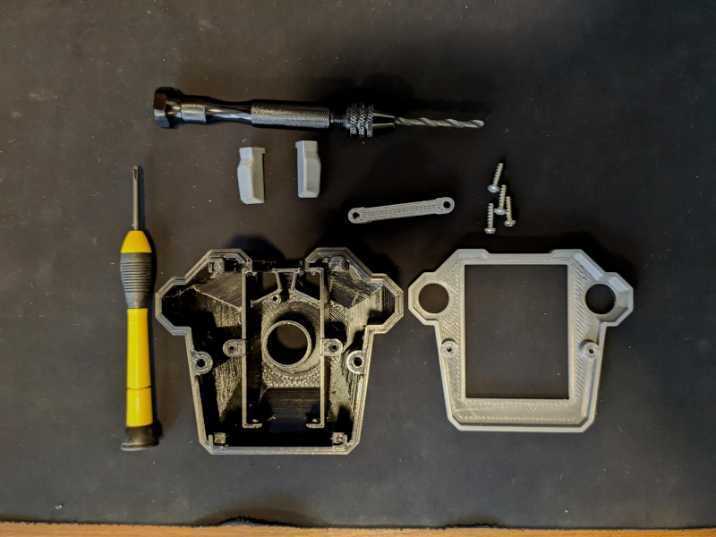
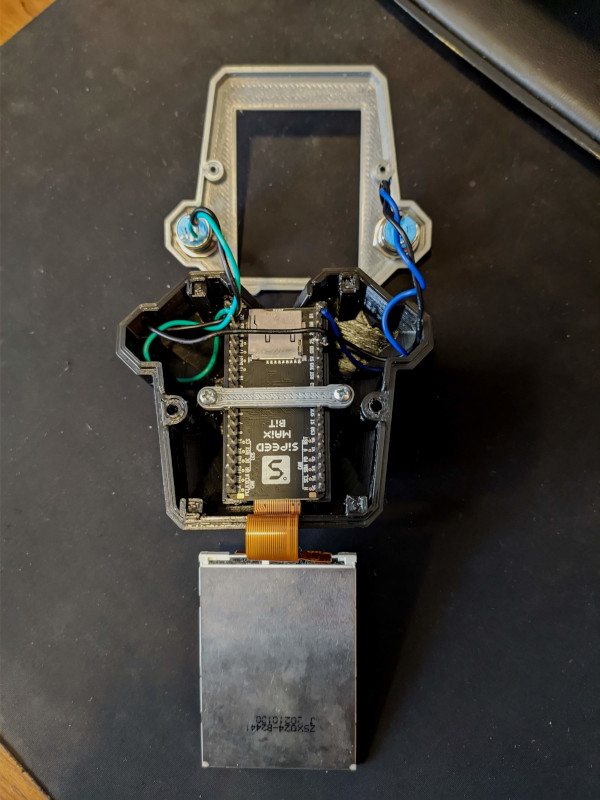
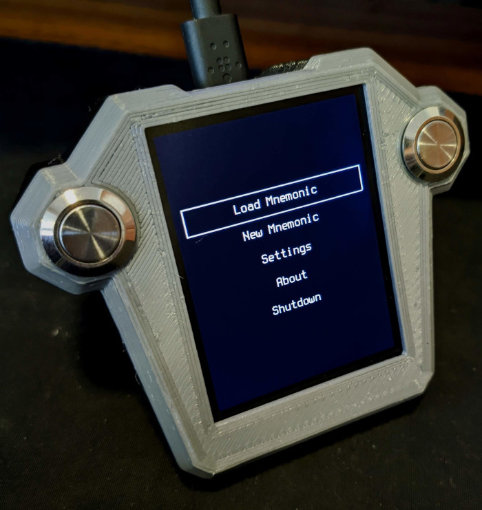
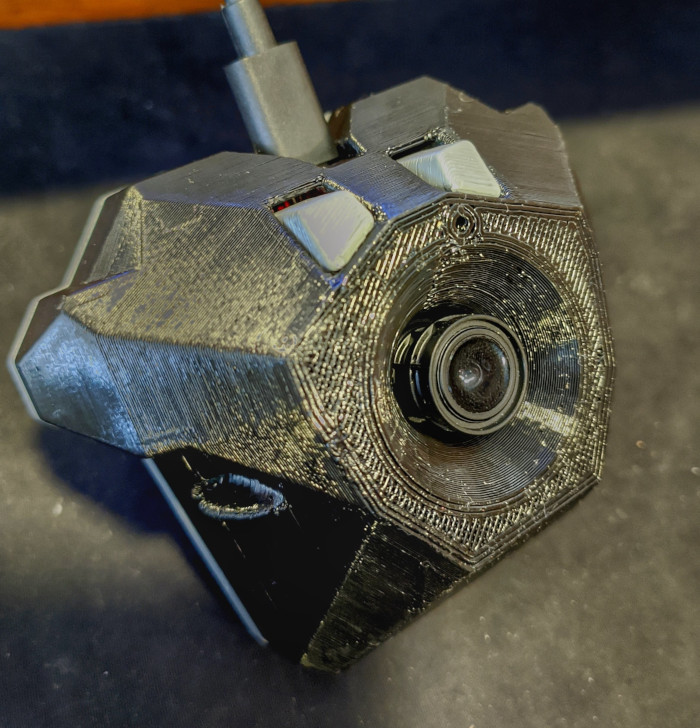

# MaixBitCase
Case for Maix Bit board, camera, display and buttons

Materials
- Printed parts
- Maix Bit with display and camera
- 4 Screws for plastics (~2.5 mm)

Instructions

- Print all parts
- Test fittings e drill/adjust holes for screws
- Insert plastic extensors for rear buttons

- Solder buttons wires directly to pins:

	22: ENTER
	
	21: PAGE

- Insert Maix Bit board with camera assembled	
- Use the printed bar with screws to fix the baord
	

- Place the display in place
- Place the case front, taking care don't "byte" wires
- Use other two screws to close the case

